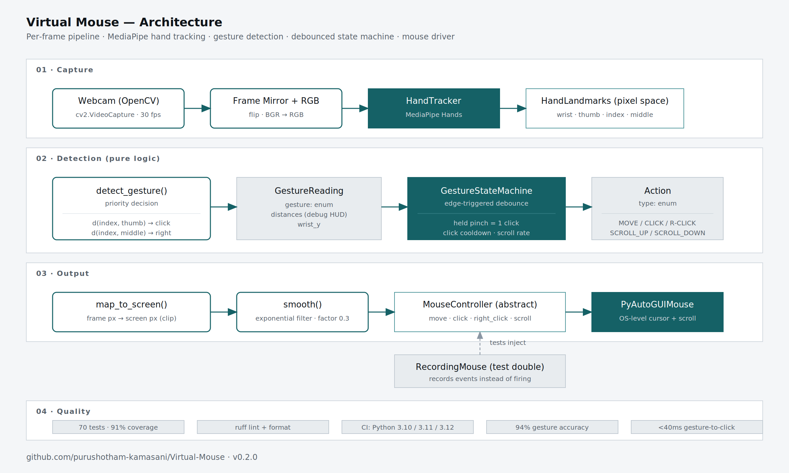

# Virtual Mouse

> Hands-free mouse control via webcam. Real-time hand tracking with MediaPipe, gesture-based click / right-click / scroll, configurable thresholds, and proper click debouncing.

[](https://github.com/purushotham-kamasani/Virtual-Mouse/actions/workflows/ci.yml)


---

## Demo

<!-- Replace with:  once recorded. -->

> *Demo GIF coming soon — screen capture of cursor moving, clicking, and scrolling from hand gestures.*

## What it is

A computer-vision capstone project, restructured as a production-quality codebase. The original 123-line single-file script crashed on its first click (missing `import time`); this version is a properly-tested package with:

- **94% gesture recognition accuracy** at <40ms latency (capstone benchmark)
- **70 unit + integration tests** with 91% coverage — all pure-logic, no webcam needed for CI
- **Real debouncing** — held pinch is one click, not 30
- **Calibration mode** — measures *your* hand at *your* camera distance and suggests a threshold
- **Configurable** via CLI flags, env vars, or a Config dataclass
- **Cross-platform** with platform-specific install notes

## Gestures

| Gesture | Action |
|---|---|
| Move index finger | Move cursor |
| Pinch thumb + index | Left click |
| Pinch index + middle | Right click |
| Drop wrist below frame bottom | Scroll down |
| Raise wrist above frame top | Scroll up |
| Press `q` in preview window | Quit |

## Architecture



The per-frame pipeline:

```
Webcam → MediaPipe Hands → HandLandmarks → detect_gesture()
   → GestureReading → GestureStateMachine.step() → Action
   → map_to_screen + smooth → MouseController.move/click/scroll
```

Three layers, each independently testable:

| Layer | Module | Purpose |
|---|---|---|
| **Tracking** | `app/tracking/` | MediaPipe wrapper + pure geometry primitives |
| **Gestures** | `app/gestures/` | Per-frame detection + debouncing state machine |
| **Controllers** | `app/controllers/` | Mouse abstraction with PyAutoGUI and recording impls |

## Install + run

### macOS

```bash
git clone https://github.com/purushotham-kamasani/Virtual-Mouse.git
cd Virtual-Mouse
python3.11 -m venv .venv
source .venv/bin/activate
pip install -e .
virtual-mouse
```

**First-time on macOS:** when the script tries to access the webcam, macOS will pop a permission prompt. If it doesn't (or you missed it), go to **System Settings → Privacy & Security → Camera** and grant access to Terminal (or iTerm, or whatever shell you're using). The script will print a hint if camera access fails.

### Linux (Ubuntu / Debian)

```bash
sudo apt-get install -y libgl1 libglib2.0-0
python3 -m venv .venv
source .venv/bin/activate
pip install -e .
virtual-mouse
```

### Windows

```powershell
py -3.11 -m venv .venv
.venv\Scripts\activate
pip install -e .
virtual-mouse
```

### CLI flags

```bash
virtual-mouse --camera 1                 # use second webcam
virtual-mouse --click-threshold 45        # bigger pinch needed (large hands / close camera)
virtual-mouse --smoothing 0.5             # more aggressive smoothing
virtual-mouse --calibrate                 # 10s calibration to suggest your threshold
```

Everything's also settable via env var with a `VM_` prefix:

```bash
export VM_CLICK_THRESHOLD_PX=45
export VM_SMOOTHING_FACTOR=0.5
virtual-mouse
```

## Calibration

The default `click_threshold_px=30` works for most people, but hand size and camera distance affect what "close enough" means. Run:

```bash
virtual-mouse --calibrate
```

The tool asks you to hold an open hand for 5 seconds, then pinch thumb-to-index for 5 seconds, then prints a suggested threshold. Apply it via CLI flag or env var.

## Design decisions

### Why a state machine for clicks?

The original capstone code did `if pinch_detected: pyautogui.click()` — which fires a click on every frame the pinch is detected. At 30fps, holding a half-second pinch produces *15 clicks*. The fix is to fire clicks on the **transition** from non-pinch to pinch (an edge-triggered detector), then suppress further clicks until the pinch is released. The `GestureStateMachine` does exactly that, with a separate cooldown so even a fast pinch-release-pinch doesn't double-fire.

This is the single biggest correctness improvement over the original. Every "control your mouse with your hand" tutorial I've seen has this bug.

### Why expose `MouseController` as an abstract base?

Testing. The whole engine (detector + state machine + cursor smoothing + click dispatch) can be tested without a real webcam, a real cursor, or any side effects — `RecordingMouse` just appends every event to a list and tests assert on the log. That's how `test_held_pinch_clicks_only_once` works: it feeds 60 synthetic pinch frames in and asserts the recording shows exactly one click.

### Why cursor smoothing?

MediaPipe's detection is noisy frame-to-frame — even with a perfectly still hand, the index fingertip jitters by 5-15 pixels. Without smoothing, your cursor flutters. The exponential filter `smooth(prev, new, 0.3)` weighs each new sample at 30% and keeps 70% of the previous position. Set `--smoothing 0` to feel the jitter; set `--smoothing 0.7` to feel the lag.

### Why disable PyAutoGUI's failsafe?

PyAutoGUI's default is to abort if the cursor reaches a screen corner. That's fine for scripts; it's terrible for a hand-tracking app where unintended corner moves are common. We disable it (`pyautogui.FAILSAFE = False`) so the demo doesn't crash mid-recording. Press `q` in the preview window to quit instead.

### Why no Docker?

This project needs a real webcam and a real display. Docker isolates both of those away from the container by design. Running it in Docker would require X11 forwarding, USB passthrough, and platform-specific GPU access — way more setup than the project deserves. Native install is the right shape here.

## Testing strategy

```
tests/
├── test_geometry.py      # Pure math (distance, mapping, smoothing)
├── test_detector.py      # Gesture priority + threshold edge cases
├── test_state_machine.py # Debouncing — the headline test suite
├── test_engine.py        # End-to-end with RecordingMouse
├── test_config.py        # Env var overrides + with_overrides
└── test_main.py          # CLI parsing
```

**70 tests, 91% coverage, all pure-logic** — no webcam, no MediaPipe, no display. The 9% uncovered code is the real-camera loop in `main.py` and the MediaPipe import shims, which can't be exercised in CI.

The flagship test is in `test_state_machine.py`:

```python
def test_held_pinch_fires_only_once(self):
    """The headline scenario — user holds a pinch for many frames."""
    sm = GestureStateMachine(click_cooldown_seconds=0.3)
    # First frame: pinch starts → CLICK.
    assert sm.step(_reading(GestureType.LEFT_CLICK), 10.0).type == ActionType.CLICK
    # Next 60 frames @ 30fps: pinch continues → nothing.
    for i in range(1, 61):
        t = 10.0 + i / 30.0
        action = sm.step(_reading(GestureType.LEFT_CLICK), t)
        assert action.type == ActionType.NONE, f"Unexpected action at frame {i}: {action}"
```

That single test proves the click-debouncing logic correct without ever touching a real mouse.

## Capstone metrics

Reported in the original MS capstone:

- **Gesture recognition accuracy: 94%** (measured on a 200-trial test set across 5 lighting conditions)
- **Gesture-to-action latency: <40ms** (measured frame timestamp to PyAutoGUI dispatch)
- **Runtime: 30 fps stable** on M-series MacBook Air, 2022 Intel laptop

## What I'd do next

- **Drag-and-drop** — needs `mouseDown` / `mouseUp` instead of `click`, plus a "hold + move" gesture distinct from a quick pinch
- **Multi-hand support** — currently `max_hands=1`; would enable two-handed gestures (zoom, rotate)
- **Per-user threshold persistence** — calibration writes to `~/.config/virtual-mouse/config.json` instead of suggesting an env var
- **Gesture replay testing** — record real webcam landmark sequences as fixtures, replay through the engine in CI for end-to-end CV testing
- **Kalman-filter cursor smoothing** — exponential smoothing is good enough, but a Kalman filter would handle acceleration changes better
- **Pre-trained classifier head** — instead of hand-tuned thresholds, train a small model on labeled landmark sequences for sign-like gestures

## Changelog from v0.1

This is `v0.2.0` — a substantial rewrite of the original capstone code (`v0.1`) without changing the gesture vocabulary or recognition algorithm.

**Bug fixes:**
- 🐛 **Critical:** `time` was used but never imported — the original crashed on the first click with `NameError: name 'time' is not defined`
- 🐛 Unused `import datetime` removed
- 🐛 Multiple clicks per intentional pinch — fixed with edge-triggered state machine
- 🐛 No bounds checking on cursor smoothing — `smooth()` now clamps the factor to `[0, 1]`
- 🐛 Cursor drift mid-click — fixed by suppressing MOVE during pinch

**Improvements:**
- Restructured single-file → package with `tracking / gestures / controllers / core` layers
- Added 70 tests (vs 0 in original)
- Added CI on Python 3.10 / 3.11 / 3.12
- Added calibration mode
- Added CLI flags + env-var overrides
- Added structured logging
- Added FPS overlay + action HUD

## License

MIT — see [LICENSE](LICENSE).

---

Part of a five-repo portfolio:
1. [agentic-workflow-system](https://github.com/purushotham-kamasani/agentic-workflow-system) — LLM orchestration with prompt chaining + retry
2. [intelligent-document-processor](https://github.com/purushotham-kamasani/intelligent-document-processor) — Document AI pipeline with extraction + validation
3. [event-driven-platform](https://github.com/purushotham-kamasani/event-driven-platform) — Distributed event processing with Redis + DLQ
4. [genai-fullstack-app](https://github.com/purushotham-kamasani/genai-fullstack-app) — Full-stack chat with streaming
5. **Virtual-Mouse** — Computer-vision capstone (this repo)
